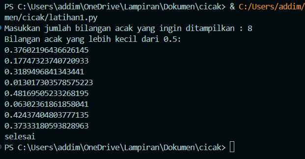
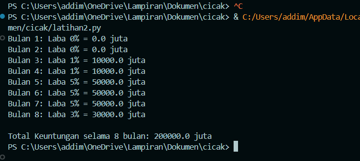
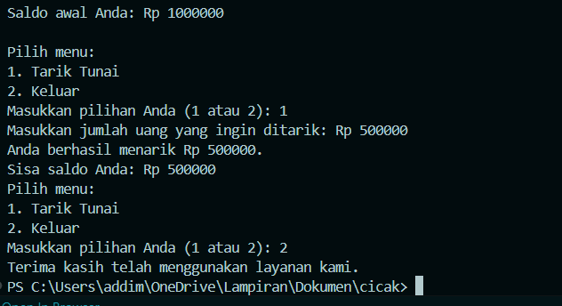

# Random 
# codingan 
```
import random

n = int(input("Masukkan jumlah bilangan acak yang ingin ditampilkan : "))
random_numbers = []

while len(random_numbers) < n:
    number = random.random()
    if number < 0.5:
        random_numbers.append(number)

print("Bilangan acak yang lebih kecil dari 0.5:")
for num in random_numbers:
    print(num)
print("selesai")
```
# Hasil Codingan 
 
# penjelasan 
dalam program ini kita membuat beberapa baris angka random dengan nilai dibawah 0,5 untuk syarat angka random tiap barisnya dan untuk memnentukan berapa baris yang akan di buat kita bisa menginput angka dari codingan di atas dan angka itu lah yang menentukan jumlah baris yang akan di isi angka random di bawah 0,5. 

# Persenan 
# Codingan 
```
modal_awal = 1000000

total_keuntungan = 0

for bulan in range(1, 9): 
    if bulan <= 2:
        laba_persen = 0    
    elif bulan == 3 or bulan == 4:
        laba_persen = 1     
    elif bulan == 5 or bulan == 6 or bulan == 7:
        laba_persen = 5    
    elif bulan == 8:
        laba_persen = 3    
    
    laba_bulan_ini = modal_awal * (laba_persen / 100)
    total_keuntungan += laba_bulan_ini

    print(f"Bulan {bulan}: Laba {laba_persen}% = {laba_bulan_ini} juta")

print("\nTotal Keuntungan selama 8 bulan:", total_keuntungan, "juta")
```
# Hasil Codingan 

# penjelasan
dalam codingan kali ini kita membuat sistem perhitungan persenan yang dimana kita akan menginput jumlah uang yang akan kita investasikan kemudian setiap bulan akan ada persenannya per bulan, dengan catatan jumlah persenan tiap bulannya bisa berbeda-beda.

# ATM
# Codingan
```
modal_awal = 1000000

total_keuntungan = 0

for bulan in range(1, 9): 
    if bulan <= 2:
        laba_persen = 0    
    elif bulan == 3 or bulan == 4:
        laba_persen = 1     
    elif bulan == 5 or bulan == 6 or bulan == 7:
        laba_persen = 5    
    elif bulan == 8:
        laba_persen = 3    
    
    laba_bulan_ini = modal_awal * (laba_persen / 100)
    total_keuntungan += laba_bulan_ini

    print(f"Bulan {bulan}: Laba {laba_persen}% = {laba_bulan_ini} juta")

print("\nTotal Keuntungan selama 8 bulan:", total_keuntungan, "juta")
```
# Hasil Codingan

# Penjelasan
dalam codingan kali ini kita akan membuat sistem penrikan saldo dari ATM. jadi sistem awalnya adalah anda akan di beri 2 bipihan yaitu "1" dan "2". pilihan satu adalah peintah untuk memasukan jumlah uang yang ingin di tarik dan saldo anda akan di kurangi jumlah penarikan yang anda masukan, dan pilihan yang ke dua adalah perintah selesai. jika sudah selesai dengan penarikan dan memilih pilihan ke 2 sistem akan mmebuatkan anda sebuah struk yang berisi total penarikan - saldo = sisa saldo yang tersisa.
